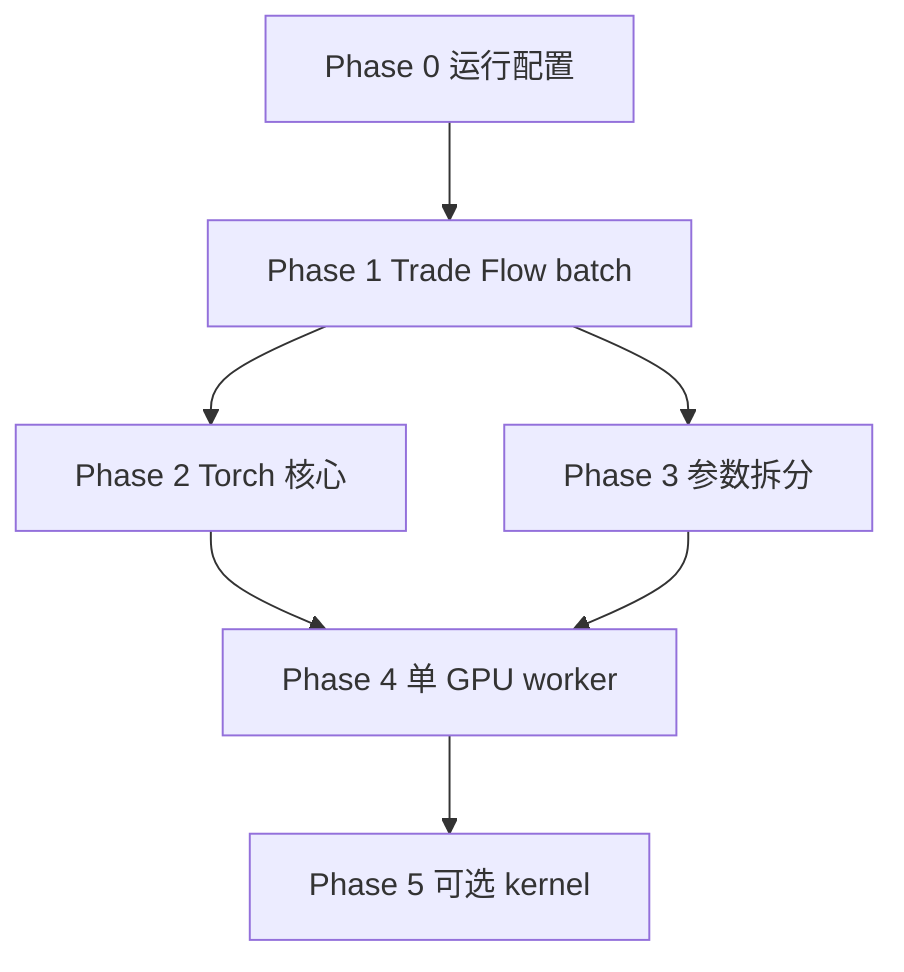

# GPU DTW 改造实施计划

> **For agentic workers:** REQUIRED SUB-SKILL: Use superpowers:subagent-driven-development (recommended) or superpowers:executing-plans to implement this plan task-by-task. Steps use checkbox (`- [ ]`) syntax for tracking.

**Goal:** 让 `gpu_only_dtw` profile 真正利用 RTX 5090，在 snapshot 级把 Return / Trade Flow 两层 DTW 整理成 GPU 友好的大 batch 形状，并消除多进程抢 GPU 的结构性损耗。

**Architecture:** 保持现有 layer graph 语义不变；在 `dtw_backend` 与两个 layer builder 之间插入「snapshot 级 pair 聚合 + 分块 GPU 调度」层；Torch 核心改为 float32 + rolling DP rows；运行层改为「多 CPU worker 准备数据 + 单 GPU 执行通道」。

**Tech Stack:** Python 3.14, PyTorch/CUDA, ProcessPoolExecutor, 现有 `run_month_graph_compute.py` 调度框架

---

## 现状诊断（已与代码核对）

| 问题 | 代码位置 | 影响 |
|------|----------|------|
| Trade Flow 逐对调用 DTW，batch=2–3 | `dtw_trade_flow_similarity.py:79-175` | 永远 `< 1024`，回退 CPU |
| `DTW_PAIR_BATCH_SIZE` 只是 CUDA 激活门槛 | `dtw_backend.py:73-86` | 名称误导，不是 chunk size |
| Torch DTW 双循环 + 每格多 kernel | `dtw_torch.py:50-74` | T=30 时约 900 次 Python 迭代 |
| float64 强制转换 | `dtw_torch.py:107`, `dtw_backend.py:50-56` | 显存/带宽浪费 |
| 完整 `[B,T+1,T+1]` DP 矩阵 | `dtw_torch.py:31-41` | O(BT²) 显存 |
| 18 ProcessPool worker 各自 CUDA | `run_month_graph_compute.py:317`, `runs/_common/run_month_mode.bat:32` | 多 context 争抢单卡 |
| `gpu_only_dtw` 名不副实 | `layer_profile_service.py:96-106` | Return 可能 CUDA，Trade Flow 实际 CPU |

**5 分钟实测基线（Ultra 9 285 + RTX 5090，18 workers）：**

- `cpu_only_dtw`: 7 snapshots / 5min
- `gpu_only_dtw`: 8 snapshots / 5min（+14%，未体现 5090 潜力）

---

## 目标与非目标

### 目标

1. Trade Flow DTW 与 Return DTW 均在 snapshot 内合并为大 batch GPU 计算。
2. 拆分并正确命名两个参数：`gpu_activation_threshold` 与 `gpu_chunk_size`。
3. Torch 核心在 float32 下与 CPU reference 误差可控（例如 max abs diff < 1e-5）。
4. `gpu_only_dtw` 在 5 分钟 benchmark 中显著优于 `cpu_only_dtw`（目标：≥ 2× snapshot 吞吐，待 Phase 4 后复测）。
5. 运行配置文档化：`gpu_only_dtw` 默认 `MAX_WORKERS=1–2`（GPU 通道）+ 可选 CPU 预处理 worker。

### 非目标（本计划不做）

- 改变 DTW 相似度数学定义或 layer filter 规则。
- 重写 community detection / consensus。
- 第一期就上 Triton 自定义 kernel（放在 Phase 5 可选）。

---

## 分阶段路线图

```text
Phase 0  参数/文档/运行配置修正          （1 天，零语义变更）
Phase 1  Trade Flow snapshot 级 batch 化  （2–3 天，最大功能缺口）
Phase 2  Torch 核心 float32 + rolling rows （2 天，降显存/提 kernel 效率）
Phase 3  参数拆分 + backend 分块调度       （1 天）
Phase 4  单 GPU worker 运行架构            （2–3 天）
Phase 5  wavefront / torch.compile（可选）   （3+ 天）
```

---

## Phase 0：立即修正（不改算法）

**目的：** 停止「18 worker + gpu_only_dtw」的误导性默认，让 benchmark 可解释。

### Task 0.1：运行配置

**Files:**
- Modify: `runs/gpu_only_dtw/run_month_start.bat`
- Modify: `runs/gpu_only_dtw/run_month_resume.bat`
- Modify: `runs/_common/run_month_mode.bat`（可选：按 PROFILE 分支默认值）

- [ ] GPU 模式默认 `MAX_WORKERS=2`，`MAX_IN_FLIGHT_TASKS=4`
- [ ] CPU 模式保持 `MAX_WORKERS=20`，`MAX_IN_FLIGHT_TASKS=24`（Ultra 9 285）
- [ ] 在 bat echo 中打印实际 DTW backend / worker 数

### Task 0.2：文档与 profile 说明

**Files:**
- Create: `docs/plans/gpu-dtw-runtime-notes.md`
- Modify: `runs/gpu_only_dtw/run_month_start.bat` 注释

- [ ] 明确写出：`gpu_only_dtw` 当前 Trade Flow 不走 CUDA 的原因
- [ ] 记录 5min benchmark 基线与推荐 worker

### 验收

- [ ] `benchmark_dtw_mode_5min.py` 在 GPU workers=2 下复跑，结果写入 `research_runs/benchmark_dtw_mode_5min/`

---

## Phase 1：Trade Flow snapshot 级 batch 化（最高优先级）

**目的：** 把「每股票对 2–3 component × 一次 DTW」改为「整个 snapshot 一次或数次大 batch」。

### 设计

```text
build_dtw_trade_flow_similarity_edges()
  ├─ coarse filter（不变）
  ├─ 收集 pair_component_records:
  │     (left_symbol, right_symbol, component_id, weight, left_seq, right_seq, support)
  ├─ 按 sequence_length 分组
  ├─ compute_dtw_similarity_scores(all_left, all_right)  # 可能 10k–100k rows
  └─ 按 (pair, component) 回填 score → 加权合成 edge
```

**关键：** 每个 component 作为独立 row 进入 batch，而不是每个 pair 单独调用。

例如 5000 候选对 × 平均 2.5 component ≈ 12,500 GPU rows，远超 1024 门槛。

### Task 1.1：提取 pair-component 收集逻辑

**Files:**
- Modify: `src/stocknetv2/domain/graph/dtw_trade_flow_similarity.py`
- Create: `src/stocknetv2/domain/graph/dtw_pair_batch.py`（共享 batch 数据结构）
- Test: `tests/test_dtw_trade_flow_similarity.py`

- [ ] 新增 `@dataclass PairComponentRecord`：`pair_key`, `component_weight`, `left`, `right`, `support_points`
- [ ] 新增 `_collect_trade_flow_pair_components(...) -> list[PairComponentRecord]`
- [ ] 保持 coarse filter、variance、overlap 规则与现实现一致

### Task 1.2：批量 DTW + 回填加权分数

**Files:**
- Modify: `src/stocknetv2/domain/graph/dtw_trade_flow_similarity.py`
- Test: `tests/test_dtw_trade_flow_similarity.py`

- [ ] 新增 `_score_pair_components_batch(records, backend, ...) -> dict[pair_key, score_info]`
- [ ] 按 pair 聚合 component scores：`score = sum(w*s)/sum(w)`
- [ ] `calculation_backend` 写入实际 effective backend（来自 `compute_dtw_similarity_scores` 返回值）
- [ ] 删除 `_combined_flow_similarity` 内的 per-pair `compute_dtw_similarity_scores` 调用

### Task 1.3：回归测试

- [ ] 用小 fixture 对比 refactor 前后 edge 集合（symbol pair + weight，允许 float tolerance）
- [ ] 新增测试：当 pair 数 ≥ 1024 且 backend=`torch_cuda` 时，effective backend 为 CUDA
- [ ] 运行 `pytest tests/test_dtw_trade_flow_similarity.py tests/test_dtw_similarity.py -q`

### 验收

- [ ] 单 snapshot Trade Flow 只调用 1 次（按 seq length 分组则 ≤3 次）`compute_dtw_similarity_scores`
- [ ] GPU profile 下 Trade Flow layer 的 `calculation_backend` 可出现 `torch_cuda:cuda`

---

## Phase 2：Torch DTW 核心优化

**目的：** 降低 kernel launch 开销与显存占用，让大 batch 真正跑满 5090。

### Task 2.1：float32 可配置 + 精度验证

**Files:**
- Modify: `src/stocknetv2/domain/graph/dtw_torch.py`
- Modify: `src/stocknetv2/domain/graph/dtw_backend.py`
- Test: `tests/test_dtw_torch.py`, `tests/test_benchmark_dtw_backends.py`

- [ ] `_prepare_batch_tensor` 默认 `float32`，保留 `float64` 开关（仅测试/对照）
- [ ] 新增测试：随机 batch 上 fp32 vs cpu_python max abs diff < 1e-5
- [ ] 新增测试：fp32 vs fp64 torch max abs diff < 1e-6

### Task 2.2：rolling two-row DP

**Files:**
- Modify: `src/stocknetv2/domain/graph/dtw_torch.py`
- Test: `tests/test_dtw_torch.py`

- [ ] 用 `prev_row`, `curr_row`（shape `[B, T+1]`）替代完整 `costs[B,T+1,T+1]`
- [ ] `lengths` 同样 rolling；tie-break 逻辑与现实现一致
- [ ] 现有 reference 测试全部通过

### Task 2.3：（可选）减少 Python 循环开销

- [ ] 评估把双重 loop 包进 `@torch.compile` 的单函数（Phase 5 前置 spike）
- [ ] 若 compile 不稳定，保留 rolling rows 版本作为 Phase 2 交付

### 验收

- [ ] 显存：batch=8192, T=30 时峰值显存显著低于旧版（记录 benchmark 数字）
- [ ] 正确性：全量 dtw torch 单测通过

---

## Phase 3：参数语义拆分

**目的：** 消除 `dtw_torch_batch_pair_threshold` / `DTW_PAIR_BATCH_SIZE` 的误导。

### Task 3.1：配置模型

**Files:**
- Modify: `src/stocknetv2/domain/graph/layer_config.py` (`DTWLayerConfig`)
- Modify: `src/stocknetv2/domain/graph/dtw_backend.py`
- Modify: `scripts/run_month_graph_compute.py`
- Modify: `runs/_common/run_month_mode.bat`

- [ ] 新增字段：
  - `torch_activation_pair_threshold: int = 1024`  # 低于此值走 cpu_python
  - `torch_gpu_chunk_size: int = 8192`           # CUDA 路径上分块大小
- [ ] 保留旧名 alias 一个版本周期：
  - CLI `--dtw-pair-batch-size` → 映射到 `torch_activation_pair_threshold`
  - 文档标注 deprecated

### Task 3.2：分块调度

**Files:**
- Modify: `src/stocknetv2/domain/graph/dtw_backend.py`

- [ ] `compute_dtw_similarity_scores` 在 CUDA 路径按 `torch_gpu_chunk_size` 切片
- [ ] 返回合并后的 scores + 单次 effective backend 标签
- [ ] 测试：15000 pairs 被切成 8192 + 6808 两次 torch 调用

### 验收

- [ ] 新参数在 `run_config.json` 中可见
- [ ] 旧 bat 脚本不修改也能跑（backward compatible）

---

## Phase 4：单 GPU worker 运行架构

**目的：** 解决 18 个 process 抢一张 5090 的问题。

### 架构

```text
run_month_graph_compute (parent)
  ├─ CPU ProcessPool (N workers, dtw_backend=cpu_python)
  │     └─ 负责：读 pack、非 DTW layer、收集 pair records
  └─ GPU DTW Service (1 process, 单 CUDA context)
        └─ 负责：接收 pair batch 请求，执行 torch_cuda，返回 scores
```

**简化替代方案（若 IPC 成本高）：**

- snapshot block 内顺序执行，但 **全局只允许 1 个 worker 使用 `torch_cuda`**
- 其余 worker 强制 `cpu_python` 或使用 `CUDA_VISIBLE_DEVICES` + 文件锁
- 第一阶段可用 `max_workers=1` + Phase 1 batch 化获得大部分收益

### Task 4.1：DTW 执行服务抽象

**Files:**
- Create: `src/stocknetv2/infrastructure/dtw/dtw_execution_service.py`
- Modify: `src/stocknetv2/domain/graph/dtw_backend.py`
- Test: `tests/test_dtw_execution_service.py`

- [ ] 定义接口 `DtwExecutionService.compute(left, right, settings) -> scores`
- [ ] 实现 `InProcessDtwExecutionService`（当前行为）
- [ ] 实现 `SharedGpuDtwExecutionService`（单进程 GPU 队列）

### Task 4.2：接入 snapshot block worker

**Files:**
- Modify: `scripts/run_month_graph_compute.py`
- Modify: `src/stocknetv2/application/services/layer_worker.py`

- [ ] 新增 CLI：`--gpu-dtw-workers`（默认 1）
- [ ] `gpu_only_dtw` profile 自动设置：`max_workers=16`, `gpu_dtw_workers=1`
- [ ] 或：`max_workers=1` 直到 SharedGpu 服务完成

### Task 4.3：运行脚本

**Files:**
- Modify: `runs/gpu_only_dtw/run_month_start.bat`
- Modify: `scripts/benchmark_dtw_mode_5min.py`

- [ ] 更新 benchmark 脚本支持 worker sweep
- [ ] 文档记录最优组合

### 验收

- [ ] `nvidia-smi` 上仅 1 个 Python 进程持有主要 CUDA context
- [ ] 5min benchmark：`gpu_only_dtw` ≥ 2× `cpu_only_dtw` snapshot 数（目标值，可调整）

---

## Phase 5：高级 kernel（可选）

- [ ] Spike：`torch.compile(batched_dtw_similarity_torch)` 在 T=30, B=16384 下的吞吐
- [ ] Spike：anti-diagonal wavefront DTW（Triton/CUDA）
- [ ] 若收益 >30%，替换 `dtw_torch.py` 热路径
- [ ] 否则保留 Phase 2 rolling rows 版本

---

## 测试与验证矩阵

| 阶段 | 单测 | 集成 | 性能 |
|------|------|------|------|
| Phase 1 | trade flow edge 等价 | 单 snapshot 端到端 | pair 调用次数 = 1 |
| Phase 2 | torch vs cpu reference | — | 显存峰值下降 |
| Phase 3 | chunk 切分 | CLI alias | — |
| Phase 4 | execution service | 5min benchmark | nvidia-smi 单 context |
| Phase 5 | kernel parity | 5min benchmark | 吞吐提升 |

**固定 benchmark 命令：**

```powershell
py -3 scripts/benchmark_dtw_mode_5min.py --duration-seconds 300
```

**结果归档：** `research_runs/benchmark_dtw_mode_5min/summary.json`

---

## 推荐实施顺序与依赖



**最小可行路径（MVP）：** Phase 0 + Phase 1 + Phase 2 → 已应看到 GPU 明显收益，无需等待 Phase 4。

---

## 风险与缓解

| 风险 | 缓解 |
|------|------|
| Trade Flow batch 化后 edge 与旧结果略有浮点差异 | 固定 tolerance 测试；保留 golden snapshot fixture |
| float32 误差影响 downstream ranking | 对比 top-k edge 重叠率；必要时仅 GPU 路径用 fp32 |
| 单 GPU worker IPC 复杂 | MVP 先 `max_workers=1` + 大 batch |
| Phase 4 改动 run loop 面大 | 分 PR：Phase 1/2 可独立合并 |

---

## PR 拆分建议

1. **PR-1** Phase 0：bat 默认值 + runtime notes
2. **PR-2** Phase 1：Trade Flow snapshot batch（含测试）
3. **PR-3** Phase 2：float32 + rolling rows
4. **PR-4** Phase 3：参数 rename + chunk
5. **PR-5** Phase 4：GPU execution service + scheduler
6. **PR-6** Phase 5：kernel spike（可选）

---

## 当前行动建议

在你这台机器上，**现在就可以做、且不改代码的：**

- 生产跑批用 **`cpu_only_dtw` + 20 workers**
- 不要指望 **`gpu_only_dtw` + 18 workers** 有数量级提升

**最值得优先开发的代码变更：**

> **Phase 1 — Trade Flow snapshot 级 batch 化**

这是「GPU 名称误导」的根因，也是 Return / Trade Flow 两层 DTW 真正统一走 GPU 的前提。
